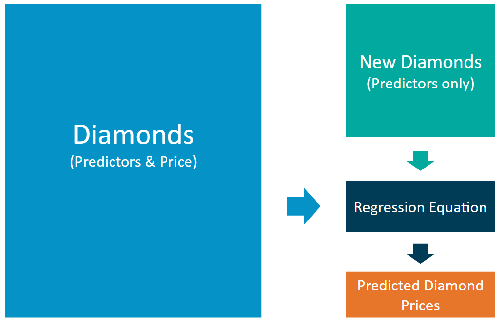
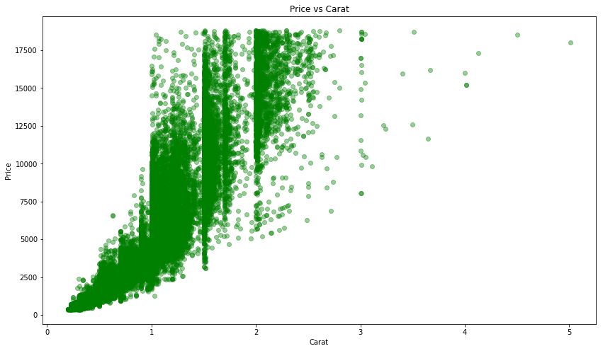
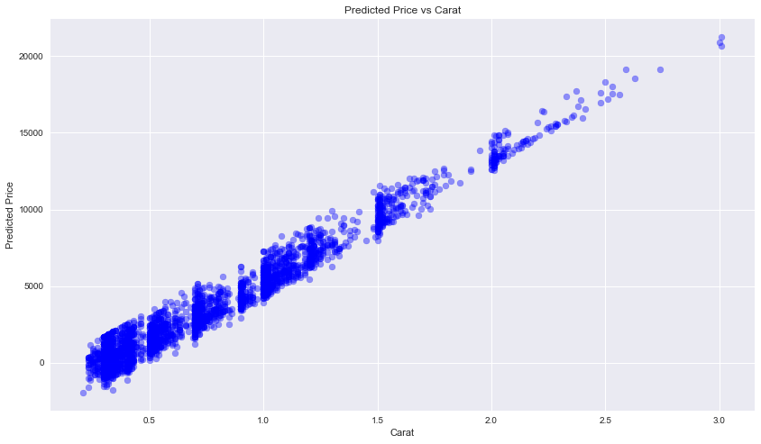
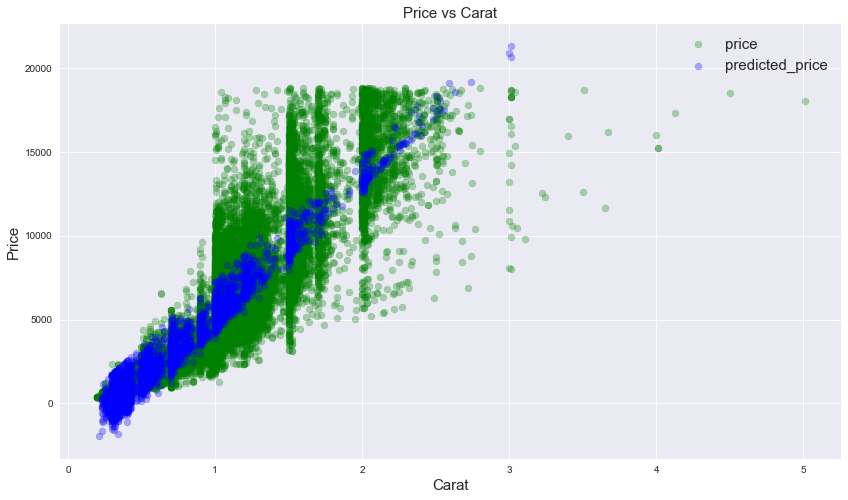

```python
import pandas as pd
import numpy as np
import matplotlib.pyplot as plt
%matplotlib inline
```

## Predictive Diagram


### Price Equation
**Price** = -5,269 + 8,413 x **Carat** + 158.1 x **Cut** + 454 x **Clarity**


```python
diamonds = pd.read_csv('data/diamonds.csv')
new_diamonds = pd.read_csv('data/new-diamonds.csv')
```

### Preview the data used to build the regression model


```python
diamonds
```


<div>
<style>
    .dataframe thead tr:only-child th {
        text-align: right;
    }

    .dataframe thead th {
        text-align: left;
    }

    .dataframe tbody tr th {
        vertical-align: top;
    }
</style>
<table border="1" class="dataframe">
  <thead>
    <tr style="text-align: right;">
      <th></th>
      <th>Unnamed: 0</th>
      <th>carat</th>
      <th>cut</th>
      <th>cut_ord</th>
      <th>color</th>
      <th>clarity</th>
      <th>clarity_ord</th>
      <th>price</th>
    </tr>
  </thead>
  <tbody>
    <tr>
      <th>0</th>
      <td>1</td>
      <td>0.51</td>
      <td>Premium</td>
      <td>4</td>
      <td>F</td>
      <td>VS1</td>
      <td>4</td>
      <td>1749</td>
    </tr>
    <tr>
      <th>1</th>
      <td>2</td>
      <td>2.25</td>
      <td>Fair</td>
      <td>1</td>
      <td>G</td>
      <td>I1</td>
      <td>1</td>
      <td>7069</td>
    </tr>
    <tr>
      <th>2</th>
      <td>3</td>
      <td>0.70</td>
      <td>Very Good</td>
      <td>3</td>
      <td>E</td>
      <td>VS2</td>
      <td>5</td>
      <td>2757</td>
    </tr>
    <tr>
      <th>3</th>
      <td>4</td>
      <td>0.47</td>
      <td>Good</td>
      <td>2</td>
      <td>F</td>
      <td>VS1</td>
      <td>4</td>
      <td>1243</td>
    </tr>
    <tr>
      <th>4</th>
      <td>5</td>
      <td>0.30</td>
      <td>Ideal</td>
      <td>5</td>
      <td>G</td>
      <td>VVS1</td>
      <td>7</td>
      <td>789</td>
    </tr>
    <tr>
      <th>5</th>
      <td>6</td>
      <td>0.33</td>
      <td>Ideal</td>
      <td>5</td>
      <td>D</td>
      <td>SI1</td>
      <td>3</td>
      <td>728</td>
    </tr>
    <tr>
      <th>6</th>
      <td>7</td>
      <td>2.01</td>
      <td>Very Good</td>
      <td>3</td>
      <td>G</td>
      <td>SI1</td>
      <td>3</td>
      <td>18398</td>
    </tr>
    <tr>
      <th>7</th>
      <td>8</td>
      <td>0.51</td>
      <td>Ideal</td>
      <td>5</td>
      <td>F</td>
      <td>VVS2</td>
      <td>6</td>
      <td>2203</td>
    </tr>
    <tr>
      <th>8</th>
      <td>9</td>
      <td>1.70</td>
      <td>Premium</td>
      <td>4</td>
      <td>D</td>
      <td>SI1</td>
      <td>3</td>
      <td>15100</td>
    </tr>
    <tr>
      <th>9</th>
      <td>10</td>
      <td>0.53</td>
      <td>Premium</td>
      <td>4</td>
      <td>D</td>
      <td>VS2</td>
      <td>5</td>
      <td>1857</td>
    </tr>
    <tr>
      <th>10</th>
      <td>11</td>
      <td>0.39</td>
      <td>Premium</td>
      <td>4</td>
      <td>H</td>
      <td>SI1</td>
      <td>3</td>
      <td>834</td>
    </tr>
    <tr>
      <th>11</th>
      <td>12</td>
      <td>1.50</td>
      <td>Very Good</td>
      <td>3</td>
      <td>H</td>
      <td>SI1</td>
      <td>3</td>
      <td>7708</td>
    </tr>
    <tr>
      <th>12</th>
      <td>13</td>
      <td>1.00</td>
      <td>Premium</td>
      <td>4</td>
      <td>E</td>
      <td>VS2</td>
      <td>5</td>
      <td>6272</td>
    </tr>
    <tr>
      <th>13</th>
      <td>14</td>
      <td>1.29</td>
      <td>Ideal</td>
      <td>5</td>
      <td>J</td>
      <td>VS1</td>
      <td>4</td>
      <td>5676</td>
    </tr>
    <tr>
      <th>14</th>
      <td>15</td>
      <td>2.01</td>
      <td>Good</td>
      <td>2</td>
      <td>D</td>
      <td>SI2</td>
      <td>2</td>
      <td>16776</td>
    </tr>
    <tr>
      <th>15</th>
      <td>16</td>
      <td>1.13</td>
      <td>Ideal</td>
      <td>5</td>
      <td>G</td>
      <td>VS1</td>
      <td>4</td>
      <td>7404</td>
    </tr>
    <tr>
      <th>16</th>
      <td>17</td>
      <td>0.70</td>
      <td>Ideal</td>
      <td>5</td>
      <td>I</td>
      <td>SI2</td>
      <td>2</td>
      <td>1702</td>
    </tr>
    <tr>
      <th>17</th>
      <td>18</td>
      <td>0.38</td>
      <td>Very Good</td>
      <td>3</td>
      <td>I</td>
      <td>VS1</td>
      <td>4</td>
      <td>606</td>
    </tr>
    <tr>
      <th>18</th>
      <td>19</td>
      <td>1.17</td>
      <td>Ideal</td>
      <td>5</td>
      <td>H</td>
      <td>SI2</td>
      <td>2</td>
      <td>5423</td>
    </tr>
    <tr>
      <th>19</th>
      <td>20</td>
      <td>1.51</td>
      <td>Premium</td>
      <td>4</td>
      <td>F</td>
      <td>SI1</td>
      <td>3</td>
      <td>8033</td>
    </tr>
    <tr>
      <th>20</th>
      <td>21</td>
      <td>0.40</td>
      <td>Ideal</td>
      <td>5</td>
      <td>D</td>
      <td>VVS1</td>
      <td>7</td>
      <td>1279</td>
    </tr>
    <tr>
      <th>21</th>
      <td>22</td>
      <td>0.41</td>
      <td>Very Good</td>
      <td>3</td>
      <td>F</td>
      <td>VS2</td>
      <td>5</td>
      <td>863</td>
    </tr>
    <tr>
      <th>22</th>
      <td>23</td>
      <td>0.51</td>
      <td>Ideal</td>
      <td>5</td>
      <td>G</td>
      <td>VVS1</td>
      <td>7</td>
      <td>1893</td>
    </tr>
    <tr>
      <th>23</th>
      <td>24</td>
      <td>1.00</td>
      <td>Premium</td>
      <td>4</td>
      <td>H</td>
      <td>SI2</td>
      <td>2</td>
      <td>3584</td>
    </tr>
    <tr>
      <th>24</th>
      <td>25</td>
      <td>1.09</td>
      <td>Ideal</td>
      <td>5</td>
      <td>F</td>
      <td>VVS2</td>
      <td>6</td>
      <td>10196</td>
    </tr>
    <tr>
      <th>25</th>
      <td>26</td>
      <td>0.39</td>
      <td>Good</td>
      <td>2</td>
      <td>E</td>
      <td>VS1</td>
      <td>4</td>
      <td>1082</td>
    </tr>
    <tr>
      <th>26</th>
      <td>27</td>
      <td>0.72</td>
      <td>Premium</td>
      <td>4</td>
      <td>E</td>
      <td>VS2</td>
      <td>5</td>
      <td>3024</td>
    </tr>
    <tr>
      <th>27</th>
      <td>28</td>
      <td>1.14</td>
      <td>Very Good</td>
      <td>3</td>
      <td>E</td>
      <td>SI2</td>
      <td>2</td>
      <td>5593</td>
    </tr>
    <tr>
      <th>28</th>
      <td>29</td>
      <td>0.30</td>
      <td>Ideal</td>
      <td>5</td>
      <td>D</td>
      <td>VS2</td>
      <td>5</td>
      <td>710</td>
    </tr>
    <tr>
      <th>29</th>
      <td>30</td>
      <td>0.30</td>
      <td>Ideal</td>
      <td>5</td>
      <td>H</td>
      <td>SI1</td>
      <td>3</td>
      <td>465</td>
    </tr>
    <tr>
      <th>...</th>
      <td>...</td>
      <td>...</td>
      <td>...</td>
      <td>...</td>
      <td>...</td>
      <td>...</td>
      <td>...</td>
      <td>...</td>
    </tr>
    <tr>
      <th>49970</th>
      <td>49971</td>
      <td>1.83</td>
      <td>Premium</td>
      <td>4</td>
      <td>H</td>
      <td>SI1</td>
      <td>3</td>
      <td>10162</td>
    </tr>
    <tr>
      <th>49971</th>
      <td>49972</td>
      <td>1.11</td>
      <td>Ideal</td>
      <td>5</td>
      <td>I</td>
      <td>VS2</td>
      <td>5</td>
      <td>5506</td>
    </tr>
    <tr>
      <th>49972</th>
      <td>49973</td>
      <td>1.00</td>
      <td>Very Good</td>
      <td>3</td>
      <td>E</td>
      <td>SI2</td>
      <td>2</td>
      <td>3763</td>
    </tr>
    <tr>
      <th>49973</th>
      <td>49974</td>
      <td>0.61</td>
      <td>Ideal</td>
      <td>5</td>
      <td>D</td>
      <td>VVS1</td>
      <td>7</td>
      <td>3625</td>
    </tr>
    <tr>
      <th>49974</th>
      <td>49975</td>
      <td>0.80</td>
      <td>Very Good</td>
      <td>3</td>
      <td>G</td>
      <td>SI2</td>
      <td>2</td>
      <td>2451</td>
    </tr>
    <tr>
      <th>49975</th>
      <td>49976</td>
      <td>0.53</td>
      <td>Ideal</td>
      <td>5</td>
      <td>E</td>
      <td>SI1</td>
      <td>3</td>
      <td>1564</td>
    </tr>
    <tr>
      <th>49976</th>
      <td>49977</td>
      <td>0.34</td>
      <td>Very Good</td>
      <td>3</td>
      <td>E</td>
      <td>VS2</td>
      <td>5</td>
      <td>659</td>
    </tr>
    <tr>
      <th>49977</th>
      <td>49978</td>
      <td>1.22</td>
      <td>Ideal</td>
      <td>5</td>
      <td>H</td>
      <td>VS2</td>
      <td>5</td>
      <td>7584</td>
    </tr>
    <tr>
      <th>49978</th>
      <td>49979</td>
      <td>0.57</td>
      <td>Very Good</td>
      <td>3</td>
      <td>J</td>
      <td>VS1</td>
      <td>4</td>
      <td>1270</td>
    </tr>
    <tr>
      <th>49979</th>
      <td>49980</td>
      <td>0.58</td>
      <td>Very Good</td>
      <td>3</td>
      <td>I</td>
      <td>VVS1</td>
      <td>7</td>
      <td>1790</td>
    </tr>
    <tr>
      <th>49980</th>
      <td>49981</td>
      <td>0.32</td>
      <td>Ideal</td>
      <td>5</td>
      <td>I</td>
      <td>SI2</td>
      <td>2</td>
      <td>371</td>
    </tr>
    <tr>
      <th>49981</th>
      <td>49982</td>
      <td>0.42</td>
      <td>Premium</td>
      <td>4</td>
      <td>D</td>
      <td>SI1</td>
      <td>3</td>
      <td>1040</td>
    </tr>
    <tr>
      <th>49982</th>
      <td>49983</td>
      <td>0.35</td>
      <td>Very Good</td>
      <td>3</td>
      <td>H</td>
      <td>SI1</td>
      <td>3</td>
      <td>491</td>
    </tr>
    <tr>
      <th>49983</th>
      <td>49984</td>
      <td>0.46</td>
      <td>Ideal</td>
      <td>5</td>
      <td>E</td>
      <td>SI2</td>
      <td>2</td>
      <td>870</td>
    </tr>
    <tr>
      <th>49984</th>
      <td>49985</td>
      <td>0.70</td>
      <td>Ideal</td>
      <td>5</td>
      <td>I</td>
      <td>VS1</td>
      <td>4</td>
      <td>2398</td>
    </tr>
    <tr>
      <th>49985</th>
      <td>49986</td>
      <td>0.43</td>
      <td>Ideal</td>
      <td>5</td>
      <td>G</td>
      <td>VVS2</td>
      <td>6</td>
      <td>1129</td>
    </tr>
    <tr>
      <th>49986</th>
      <td>49987</td>
      <td>1.01</td>
      <td>Premium</td>
      <td>4</td>
      <td>G</td>
      <td>VS1</td>
      <td>4</td>
      <td>6932</td>
    </tr>
    <tr>
      <th>49987</th>
      <td>49988</td>
      <td>1.03</td>
      <td>Premium</td>
      <td>4</td>
      <td>F</td>
      <td>VS1</td>
      <td>4</td>
      <td>7328</td>
    </tr>
    <tr>
      <th>49988</th>
      <td>49989</td>
      <td>0.47</td>
      <td>Ideal</td>
      <td>5</td>
      <td>H</td>
      <td>VS2</td>
      <td>5</td>
      <td>1058</td>
    </tr>
    <tr>
      <th>49989</th>
      <td>49990</td>
      <td>1.01</td>
      <td>Premium</td>
      <td>4</td>
      <td>I</td>
      <td>VVS1</td>
      <td>7</td>
      <td>4989</td>
    </tr>
    <tr>
      <th>49990</th>
      <td>49991</td>
      <td>1.21</td>
      <td>Good</td>
      <td>2</td>
      <td>F</td>
      <td>VS2</td>
      <td>5</td>
      <td>7786</td>
    </tr>
    <tr>
      <th>49991</th>
      <td>49992</td>
      <td>0.43</td>
      <td>Ideal</td>
      <td>5</td>
      <td>I</td>
      <td>VVS1</td>
      <td>7</td>
      <td>848</td>
    </tr>
    <tr>
      <th>49992</th>
      <td>49993</td>
      <td>0.70</td>
      <td>Premium</td>
      <td>4</td>
      <td>G</td>
      <td>VVS1</td>
      <td>7</td>
      <td>3105</td>
    </tr>
    <tr>
      <th>49993</th>
      <td>49994</td>
      <td>0.50</td>
      <td>Ideal</td>
      <td>5</td>
      <td>G</td>
      <td>VS2</td>
      <td>5</td>
      <td>1449</td>
    </tr>
    <tr>
      <th>49994</th>
      <td>49995</td>
      <td>0.33</td>
      <td>Very Good</td>
      <td>3</td>
      <td>G</td>
      <td>VVS2</td>
      <td>6</td>
      <td>692</td>
    </tr>
    <tr>
      <th>49995</th>
      <td>49996</td>
      <td>0.71</td>
      <td>Ideal</td>
      <td>5</td>
      <td>H</td>
      <td>VVS1</td>
      <td>7</td>
      <td>2918</td>
    </tr>
    <tr>
      <th>49996</th>
      <td>49997</td>
      <td>0.43</td>
      <td>Ideal</td>
      <td>5</td>
      <td>G</td>
      <td>VVS2</td>
      <td>6</td>
      <td>1056</td>
    </tr>
    <tr>
      <th>49997</th>
      <td>49998</td>
      <td>1.14</td>
      <td>Premium</td>
      <td>4</td>
      <td>G</td>
      <td>VS2</td>
      <td>5</td>
      <td>6619</td>
    </tr>
    <tr>
      <th>49998</th>
      <td>49999</td>
      <td>1.01</td>
      <td>Premium</td>
      <td>4</td>
      <td>E</td>
      <td>VS2</td>
      <td>5</td>
      <td>6787</td>
    </tr>
    <tr>
      <th>49999</th>
      <td>50000</td>
      <td>1.77</td>
      <td>Premium</td>
      <td>4</td>
      <td>J</td>
      <td>VS2</td>
      <td>5</td>
      <td>9428</td>
    </tr>
  </tbody>
</table>
<p>50000 rows × 8 columns</p>
</div>


* **Carat** represents the weight of the diamond, and is a numerical variable.

* **Cut** represents the quality of the cut of the diamond, and falls into 5 categories: fair, good, very good, ideal, and premium. Each of these categories are represented by a number, 1-5, in the Cut_Ord variable.

* **Clarity** represents the internal purity of the diamond, and falls into 8 categories: I1, SI2, SI1, VS1, VS2, VVS2, VVS1, and IF. Each of these categories are represented by a number, 1-8, in the Clarity_Ord variable

### Preview the data of the diamonds the company would like to purchase


```python
new_diamonds
```


<div>
<style>
    .dataframe thead tr:only-child th {
        text-align: right;
    }

    .dataframe thead th {
        text-align: left;
    }

    .dataframe tbody tr th {
        vertical-align: top;
    }
</style>
<table border="1" class="dataframe">
  <thead>
    <tr style="text-align: right;">
      <th></th>
      <th>Unnamed: 0</th>
      <th>carat</th>
      <th>cut</th>
      <th>cut_ord</th>
      <th>color</th>
      <th>clarity</th>
      <th>clarity_ord</th>
    </tr>
  </thead>
  <tbody>
    <tr>
      <th>0</th>
      <td>1</td>
      <td>1.22</td>
      <td>Premium</td>
      <td>4</td>
      <td>G</td>
      <td>SI1</td>
      <td>3</td>
    </tr>
    <tr>
      <th>1</th>
      <td>2</td>
      <td>1.01</td>
      <td>Good</td>
      <td>2</td>
      <td>G</td>
      <td>VS2</td>
      <td>5</td>
    </tr>
    <tr>
      <th>2</th>
      <td>3</td>
      <td>0.71</td>
      <td>Very Good</td>
      <td>3</td>
      <td>I</td>
      <td>VS2</td>
      <td>5</td>
    </tr>
    <tr>
      <th>3</th>
      <td>4</td>
      <td>1.01</td>
      <td>Ideal</td>
      <td>5</td>
      <td>D</td>
      <td>SI2</td>
      <td>2</td>
    </tr>
    <tr>
      <th>4</th>
      <td>5</td>
      <td>0.27</td>
      <td>Ideal</td>
      <td>5</td>
      <td>H</td>
      <td>VVS2</td>
      <td>6</td>
    </tr>
    <tr>
      <th>5</th>
      <td>6</td>
      <td>0.52</td>
      <td>Premium</td>
      <td>4</td>
      <td>G</td>
      <td>VS1</td>
      <td>4</td>
    </tr>
    <tr>
      <th>6</th>
      <td>7</td>
      <td>1.01</td>
      <td>Premium</td>
      <td>4</td>
      <td>F</td>
      <td>SI1</td>
      <td>3</td>
    </tr>
    <tr>
      <th>7</th>
      <td>8</td>
      <td>0.59</td>
      <td>Ideal</td>
      <td>5</td>
      <td>D</td>
      <td>SI1</td>
      <td>3</td>
    </tr>
    <tr>
      <th>8</th>
      <td>9</td>
      <td>1.01</td>
      <td>Good</td>
      <td>2</td>
      <td>E</td>
      <td>SI1</td>
      <td>3</td>
    </tr>
    <tr>
      <th>9</th>
      <td>10</td>
      <td>2.03</td>
      <td>Ideal</td>
      <td>5</td>
      <td>F</td>
      <td>SI2</td>
      <td>2</td>
    </tr>
    <tr>
      <th>10</th>
      <td>11</td>
      <td>1.35</td>
      <td>Premium</td>
      <td>4</td>
      <td>H</td>
      <td>VS2</td>
      <td>5</td>
    </tr>
    <tr>
      <th>11</th>
      <td>12</td>
      <td>0.74</td>
      <td>Ideal</td>
      <td>5</td>
      <td>G</td>
      <td>SI1</td>
      <td>3</td>
    </tr>
    <tr>
      <th>12</th>
      <td>13</td>
      <td>0.90</td>
      <td>Premium</td>
      <td>4</td>
      <td>D</td>
      <td>SI1</td>
      <td>3</td>
    </tr>
    <tr>
      <th>13</th>
      <td>14</td>
      <td>0.30</td>
      <td>Good</td>
      <td>2</td>
      <td>G</td>
      <td>VS2</td>
      <td>5</td>
    </tr>
    <tr>
      <th>14</th>
      <td>15</td>
      <td>1.01</td>
      <td>Good</td>
      <td>2</td>
      <td>F</td>
      <td>VS2</td>
      <td>5</td>
    </tr>
    <tr>
      <th>15</th>
      <td>16</td>
      <td>1.02</td>
      <td>Good</td>
      <td>2</td>
      <td>H</td>
      <td>SI2</td>
      <td>2</td>
    </tr>
    <tr>
      <th>16</th>
      <td>17</td>
      <td>2.05</td>
      <td>Premium</td>
      <td>4</td>
      <td>G</td>
      <td>SI1</td>
      <td>3</td>
    </tr>
    <tr>
      <th>17</th>
      <td>18</td>
      <td>0.54</td>
      <td>Ideal</td>
      <td>5</td>
      <td>I</td>
      <td>SI1</td>
      <td>3</td>
    </tr>
    <tr>
      <th>18</th>
      <td>19</td>
      <td>0.72</td>
      <td>Ideal</td>
      <td>5</td>
      <td>G</td>
      <td>VS2</td>
      <td>5</td>
    </tr>
    <tr>
      <th>19</th>
      <td>20</td>
      <td>2.00</td>
      <td>Premium</td>
      <td>4</td>
      <td>J</td>
      <td>SI2</td>
      <td>2</td>
    </tr>
    <tr>
      <th>20</th>
      <td>21</td>
      <td>1.57</td>
      <td>Premium</td>
      <td>4</td>
      <td>G</td>
      <td>SI2</td>
      <td>2</td>
    </tr>
    <tr>
      <th>21</th>
      <td>22</td>
      <td>0.89</td>
      <td>Premium</td>
      <td>4</td>
      <td>G</td>
      <td>SI1</td>
      <td>3</td>
    </tr>
    <tr>
      <th>22</th>
      <td>23</td>
      <td>0.33</td>
      <td>Premium</td>
      <td>4</td>
      <td>I</td>
      <td>VVS2</td>
      <td>6</td>
    </tr>
    <tr>
      <th>23</th>
      <td>24</td>
      <td>0.30</td>
      <td>Very Good</td>
      <td>3</td>
      <td>G</td>
      <td>IF</td>
      <td>8</td>
    </tr>
    <tr>
      <th>24</th>
      <td>25</td>
      <td>1.79</td>
      <td>Very Good</td>
      <td>3</td>
      <td>I</td>
      <td>VS2</td>
      <td>5</td>
    </tr>
    <tr>
      <th>25</th>
      <td>26</td>
      <td>1.11</td>
      <td>Ideal</td>
      <td>5</td>
      <td>E</td>
      <td>SI2</td>
      <td>2</td>
    </tr>
    <tr>
      <th>26</th>
      <td>27</td>
      <td>0.79</td>
      <td>Premium</td>
      <td>4</td>
      <td>F</td>
      <td>SI1</td>
      <td>3</td>
    </tr>
    <tr>
      <th>27</th>
      <td>28</td>
      <td>0.71</td>
      <td>Very Good</td>
      <td>3</td>
      <td>F</td>
      <td>SI1</td>
      <td>3</td>
    </tr>
    <tr>
      <th>28</th>
      <td>29</td>
      <td>0.73</td>
      <td>Ideal</td>
      <td>5</td>
      <td>G</td>
      <td>SI1</td>
      <td>3</td>
    </tr>
    <tr>
      <th>29</th>
      <td>30</td>
      <td>0.90</td>
      <td>Very Good</td>
      <td>3</td>
      <td>G</td>
      <td>VS2</td>
      <td>5</td>
    </tr>
    <tr>
      <th>...</th>
      <td>...</td>
      <td>...</td>
      <td>...</td>
      <td>...</td>
      <td>...</td>
      <td>...</td>
      <td>...</td>
    </tr>
    <tr>
      <th>2970</th>
      <td>2971</td>
      <td>1.00</td>
      <td>Premium</td>
      <td>4</td>
      <td>F</td>
      <td>VS2</td>
      <td>5</td>
    </tr>
    <tr>
      <th>2971</th>
      <td>2972</td>
      <td>1.07</td>
      <td>Premium</td>
      <td>4</td>
      <td>E</td>
      <td>SI2</td>
      <td>2</td>
    </tr>
    <tr>
      <th>2972</th>
      <td>2973</td>
      <td>1.21</td>
      <td>Very Good</td>
      <td>3</td>
      <td>F</td>
      <td>VS1</td>
      <td>4</td>
    </tr>
    <tr>
      <th>2973</th>
      <td>2974</td>
      <td>0.46</td>
      <td>Fair</td>
      <td>1</td>
      <td>G</td>
      <td>VS1</td>
      <td>4</td>
    </tr>
    <tr>
      <th>2974</th>
      <td>2975</td>
      <td>0.79</td>
      <td>Good</td>
      <td>2</td>
      <td>I</td>
      <td>VS2</td>
      <td>5</td>
    </tr>
    <tr>
      <th>2975</th>
      <td>2976</td>
      <td>0.32</td>
      <td>Ideal</td>
      <td>5</td>
      <td>F</td>
      <td>VVS2</td>
      <td>6</td>
    </tr>
    <tr>
      <th>2976</th>
      <td>2977</td>
      <td>0.40</td>
      <td>Ideal</td>
      <td>5</td>
      <td>F</td>
      <td>VS2</td>
      <td>5</td>
    </tr>
    <tr>
      <th>2977</th>
      <td>2978</td>
      <td>0.51</td>
      <td>Fair</td>
      <td>1</td>
      <td>E</td>
      <td>VS2</td>
      <td>5</td>
    </tr>
    <tr>
      <th>2978</th>
      <td>2979</td>
      <td>1.05</td>
      <td>Premium</td>
      <td>4</td>
      <td>J</td>
      <td>VS1</td>
      <td>4</td>
    </tr>
    <tr>
      <th>2979</th>
      <td>2980</td>
      <td>0.43</td>
      <td>Very Good</td>
      <td>3</td>
      <td>H</td>
      <td>SI1</td>
      <td>3</td>
    </tr>
    <tr>
      <th>2980</th>
      <td>2981</td>
      <td>0.30</td>
      <td>Ideal</td>
      <td>5</td>
      <td>G</td>
      <td>VVS2</td>
      <td>6</td>
    </tr>
    <tr>
      <th>2981</th>
      <td>2982</td>
      <td>1.51</td>
      <td>Premium</td>
      <td>4</td>
      <td>E</td>
      <td>SI1</td>
      <td>3</td>
    </tr>
    <tr>
      <th>2982</th>
      <td>2983</td>
      <td>1.54</td>
      <td>Ideal</td>
      <td>5</td>
      <td>J</td>
      <td>VS2</td>
      <td>5</td>
    </tr>
    <tr>
      <th>2983</th>
      <td>2984</td>
      <td>1.16</td>
      <td>Ideal</td>
      <td>5</td>
      <td>I</td>
      <td>VS2</td>
      <td>5</td>
    </tr>
    <tr>
      <th>2984</th>
      <td>2985</td>
      <td>1.01</td>
      <td>Premium</td>
      <td>4</td>
      <td>D</td>
      <td>SI1</td>
      <td>3</td>
    </tr>
    <tr>
      <th>2985</th>
      <td>2986</td>
      <td>1.01</td>
      <td>Very Good</td>
      <td>3</td>
      <td>I</td>
      <td>VS2</td>
      <td>5</td>
    </tr>
    <tr>
      <th>2986</th>
      <td>2987</td>
      <td>0.83</td>
      <td>Premium</td>
      <td>4</td>
      <td>H</td>
      <td>SI1</td>
      <td>3</td>
    </tr>
    <tr>
      <th>2987</th>
      <td>2988</td>
      <td>0.93</td>
      <td>Very Good</td>
      <td>3</td>
      <td>F</td>
      <td>VS2</td>
      <td>5</td>
    </tr>
    <tr>
      <th>2988</th>
      <td>2989</td>
      <td>1.20</td>
      <td>Very Good</td>
      <td>3</td>
      <td>G</td>
      <td>SI2</td>
      <td>2</td>
    </tr>
    <tr>
      <th>2989</th>
      <td>2990</td>
      <td>0.80</td>
      <td>Ideal</td>
      <td>5</td>
      <td>E</td>
      <td>VVS2</td>
      <td>6</td>
    </tr>
    <tr>
      <th>2990</th>
      <td>2991</td>
      <td>1.11</td>
      <td>Ideal</td>
      <td>5</td>
      <td>D</td>
      <td>VVS2</td>
      <td>6</td>
    </tr>
    <tr>
      <th>2991</th>
      <td>2992</td>
      <td>1.31</td>
      <td>Premium</td>
      <td>4</td>
      <td>H</td>
      <td>SI2</td>
      <td>2</td>
    </tr>
    <tr>
      <th>2992</th>
      <td>2993</td>
      <td>1.11</td>
      <td>Good</td>
      <td>2</td>
      <td>F</td>
      <td>SI1</td>
      <td>3</td>
    </tr>
    <tr>
      <th>2993</th>
      <td>2994</td>
      <td>1.10</td>
      <td>Good</td>
      <td>2</td>
      <td>D</td>
      <td>SI2</td>
      <td>2</td>
    </tr>
    <tr>
      <th>2994</th>
      <td>2995</td>
      <td>1.22</td>
      <td>Premium</td>
      <td>4</td>
      <td>I</td>
      <td>SI2</td>
      <td>2</td>
    </tr>
    <tr>
      <th>2995</th>
      <td>2996</td>
      <td>0.72</td>
      <td>Ideal</td>
      <td>5</td>
      <td>F</td>
      <td>SI2</td>
      <td>2</td>
    </tr>
    <tr>
      <th>2996</th>
      <td>2997</td>
      <td>1.09</td>
      <td>Premium</td>
      <td>4</td>
      <td>I</td>
      <td>VS2</td>
      <td>5</td>
    </tr>
    <tr>
      <th>2997</th>
      <td>2998</td>
      <td>1.05</td>
      <td>Very Good</td>
      <td>3</td>
      <td>G</td>
      <td>SI1</td>
      <td>3</td>
    </tr>
    <tr>
      <th>2998</th>
      <td>2999</td>
      <td>0.70</td>
      <td>Fair</td>
      <td>1</td>
      <td>G</td>
      <td>SI1</td>
      <td>3</td>
    </tr>
    <tr>
      <th>2999</th>
      <td>3000</td>
      <td>1.01</td>
      <td>Very Good</td>
      <td>3</td>
      <td>F</td>
      <td>SI1</td>
      <td>3</td>
    </tr>
  </tbody>
</table>
<p>3000 rows × 7 columns</p>
</div>


# Understanding the Model 

**1.** According to the model, if a diamond is 1 carat heavier than another with the same cut, how much more should I expect to pay? Why?


```python
def calculate_diamond_price(carat, cut, clarity):
    diamond_price = -5269 + (8413 * carat) + (158.1 * cut) + (454 * clarity)
    return diamond_price

def format_currency(amount):
    return '${:,.2f}'.format(amount)
```


```python
diamond_one_carat = calculate_diamond_price(1,1,1)
diamond_two_carats = calculate_diamond_price(2,1,1)

price_difference = diamond_two_carats -  diamond_one_carat

print("Diamond 1 carat price:\t ",diamond_one_carat,"$\nDiamond 2 carats price:\t",diamond_two_carats,
      "$\nPrice difference:\t ",price_difference,"$")
```

    Diamond 1 carat price:	  3756.1 $
    Diamond 2 carats price:	 12169.1 $
    Price difference:	  8413.0 $
    

According to our equation: **Price** = -5,269 + 8,413 x Carat + 158.1 x Cut + 454 x Clarity 

1 carat will increase the price in **8,413 $**

**2.** If you were interested in a 1.5 carat diamond with a Very Good cut (represented by a 3 in the model) and a VS2 clarity rating (represented by a 5 in the model), how much would the model predict you should pay for it?


```python
diamond_one_half_carat = calculate_diamond_price(1.5,3,5)

print("Diamond Carat: 1.5  Cut: Very Good  Clarity: VS2 price:\t ",diamond_one_half_carat,"$")
```

    Diamond Carat: 1.5  Cut: Very Good  Clarity: VS2 price:	  10094.8 $
    

The model predicts a price of **10,094.8 $**

# Visualize the Data 

**1.** Plot 1 - Plot the data for the diamonds in the database, with carat on the x-axis and price on the y-axis. 


```python
x = diamonds['carat']
y = diamonds['price']
plt.figure(figsize=(14,8))
plt.ylabel('Price')
plt.xlabel('Carat')
plt.title('Price vs Carat')
plt.scatter(x, y, alpha=0.4, color='green')
```


    <matplotlib.collections.PathCollection at 0x13498454c50>





```python
new_diamonds["predicted_price"] = calculate_diamond_price(new_diamonds['carat'],new_diamonds['cut_ord'], new_diamonds['clarity_ord'])
```


```python
new_diamonds
```


<div>
<style>
    .dataframe thead tr:only-child th {
        text-align: right;
    }

    .dataframe thead th {
        text-align: left;
    }

    .dataframe tbody tr th {
        vertical-align: top;
    }
</style>
<table border="1" class="dataframe">
  <thead>
    <tr style="text-align: right;">
      <th></th>
      <th>Unnamed: 0</th>
      <th>carat</th>
      <th>cut</th>
      <th>cut_ord</th>
      <th>color</th>
      <th>clarity</th>
      <th>clarity_ord</th>
      <th>predicted_price</th>
    </tr>
  </thead>
  <tbody>
    <tr>
      <th>0</th>
      <td>1</td>
      <td>1.22</td>
      <td>Premium</td>
      <td>4</td>
      <td>G</td>
      <td>SI1</td>
      <td>3</td>
      <td>6989.26</td>
    </tr>
    <tr>
      <th>1</th>
      <td>2</td>
      <td>1.01</td>
      <td>Good</td>
      <td>2</td>
      <td>G</td>
      <td>VS2</td>
      <td>5</td>
      <td>5814.33</td>
    </tr>
    <tr>
      <th>2</th>
      <td>3</td>
      <td>0.71</td>
      <td>Very Good</td>
      <td>3</td>
      <td>I</td>
      <td>VS2</td>
      <td>5</td>
      <td>3448.53</td>
    </tr>
    <tr>
      <th>3</th>
      <td>4</td>
      <td>1.01</td>
      <td>Ideal</td>
      <td>5</td>
      <td>D</td>
      <td>SI2</td>
      <td>2</td>
      <td>4926.63</td>
    </tr>
    <tr>
      <th>4</th>
      <td>5</td>
      <td>0.27</td>
      <td>Ideal</td>
      <td>5</td>
      <td>H</td>
      <td>VVS2</td>
      <td>6</td>
      <td>517.01</td>
    </tr>
    <tr>
      <th>5</th>
      <td>6</td>
      <td>0.52</td>
      <td>Premium</td>
      <td>4</td>
      <td>G</td>
      <td>VS1</td>
      <td>4</td>
      <td>1554.16</td>
    </tr>
    <tr>
      <th>6</th>
      <td>7</td>
      <td>1.01</td>
      <td>Premium</td>
      <td>4</td>
      <td>F</td>
      <td>SI1</td>
      <td>3</td>
      <td>5222.53</td>
    </tr>
    <tr>
      <th>7</th>
      <td>8</td>
      <td>0.59</td>
      <td>Ideal</td>
      <td>5</td>
      <td>D</td>
      <td>SI1</td>
      <td>3</td>
      <td>1847.17</td>
    </tr>
    <tr>
      <th>8</th>
      <td>9</td>
      <td>1.01</td>
      <td>Good</td>
      <td>2</td>
      <td>E</td>
      <td>SI1</td>
      <td>3</td>
      <td>4906.33</td>
    </tr>
    <tr>
      <th>9</th>
      <td>10</td>
      <td>2.03</td>
      <td>Ideal</td>
      <td>5</td>
      <td>F</td>
      <td>SI2</td>
      <td>2</td>
      <td>13507.89</td>
    </tr>
    <tr>
      <th>10</th>
      <td>11</td>
      <td>1.35</td>
      <td>Premium</td>
      <td>4</td>
      <td>H</td>
      <td>VS2</td>
      <td>5</td>
      <td>8990.95</td>
    </tr>
    <tr>
      <th>11</th>
      <td>12</td>
      <td>0.74</td>
      <td>Ideal</td>
      <td>5</td>
      <td>G</td>
      <td>SI1</td>
      <td>3</td>
      <td>3109.12</td>
    </tr>
    <tr>
      <th>12</th>
      <td>13</td>
      <td>0.90</td>
      <td>Premium</td>
      <td>4</td>
      <td>D</td>
      <td>SI1</td>
      <td>3</td>
      <td>4297.10</td>
    </tr>
    <tr>
      <th>13</th>
      <td>14</td>
      <td>0.30</td>
      <td>Good</td>
      <td>2</td>
      <td>G</td>
      <td>VS2</td>
      <td>5</td>
      <td>-158.90</td>
    </tr>
    <tr>
      <th>14</th>
      <td>15</td>
      <td>1.01</td>
      <td>Good</td>
      <td>2</td>
      <td>F</td>
      <td>VS2</td>
      <td>5</td>
      <td>5814.33</td>
    </tr>
    <tr>
      <th>15</th>
      <td>16</td>
      <td>1.02</td>
      <td>Good</td>
      <td>2</td>
      <td>H</td>
      <td>SI2</td>
      <td>2</td>
      <td>4536.46</td>
    </tr>
    <tr>
      <th>16</th>
      <td>17</td>
      <td>2.05</td>
      <td>Premium</td>
      <td>4</td>
      <td>G</td>
      <td>SI1</td>
      <td>3</td>
      <td>13972.05</td>
    </tr>
    <tr>
      <th>17</th>
      <td>18</td>
      <td>0.54</td>
      <td>Ideal</td>
      <td>5</td>
      <td>I</td>
      <td>SI1</td>
      <td>3</td>
      <td>1426.52</td>
    </tr>
    <tr>
      <th>18</th>
      <td>19</td>
      <td>0.72</td>
      <td>Ideal</td>
      <td>5</td>
      <td>G</td>
      <td>VS2</td>
      <td>5</td>
      <td>3848.86</td>
    </tr>
    <tr>
      <th>19</th>
      <td>20</td>
      <td>2.00</td>
      <td>Premium</td>
      <td>4</td>
      <td>J</td>
      <td>SI2</td>
      <td>2</td>
      <td>13097.40</td>
    </tr>
    <tr>
      <th>20</th>
      <td>21</td>
      <td>1.57</td>
      <td>Premium</td>
      <td>4</td>
      <td>G</td>
      <td>SI2</td>
      <td>2</td>
      <td>9479.81</td>
    </tr>
    <tr>
      <th>21</th>
      <td>22</td>
      <td>0.89</td>
      <td>Premium</td>
      <td>4</td>
      <td>G</td>
      <td>SI1</td>
      <td>3</td>
      <td>4212.97</td>
    </tr>
    <tr>
      <th>22</th>
      <td>23</td>
      <td>0.33</td>
      <td>Premium</td>
      <td>4</td>
      <td>I</td>
      <td>VVS2</td>
      <td>6</td>
      <td>863.69</td>
    </tr>
    <tr>
      <th>23</th>
      <td>24</td>
      <td>0.30</td>
      <td>Very Good</td>
      <td>3</td>
      <td>G</td>
      <td>IF</td>
      <td>8</td>
      <td>1361.20</td>
    </tr>
    <tr>
      <th>24</th>
      <td>25</td>
      <td>1.79</td>
      <td>Very Good</td>
      <td>3</td>
      <td>I</td>
      <td>VS2</td>
      <td>5</td>
      <td>12534.57</td>
    </tr>
    <tr>
      <th>25</th>
      <td>26</td>
      <td>1.11</td>
      <td>Ideal</td>
      <td>5</td>
      <td>E</td>
      <td>SI2</td>
      <td>2</td>
      <td>5767.93</td>
    </tr>
    <tr>
      <th>26</th>
      <td>27</td>
      <td>0.79</td>
      <td>Premium</td>
      <td>4</td>
      <td>F</td>
      <td>SI1</td>
      <td>3</td>
      <td>3371.67</td>
    </tr>
    <tr>
      <th>27</th>
      <td>28</td>
      <td>0.71</td>
      <td>Very Good</td>
      <td>3</td>
      <td>F</td>
      <td>SI1</td>
      <td>3</td>
      <td>2540.53</td>
    </tr>
    <tr>
      <th>28</th>
      <td>29</td>
      <td>0.73</td>
      <td>Ideal</td>
      <td>5</td>
      <td>G</td>
      <td>SI1</td>
      <td>3</td>
      <td>3024.99</td>
    </tr>
    <tr>
      <th>29</th>
      <td>30</td>
      <td>0.90</td>
      <td>Very Good</td>
      <td>3</td>
      <td>G</td>
      <td>VS2</td>
      <td>5</td>
      <td>5047.00</td>
    </tr>
    <tr>
      <th>...</th>
      <td>...</td>
      <td>...</td>
      <td>...</td>
      <td>...</td>
      <td>...</td>
      <td>...</td>
      <td>...</td>
      <td>...</td>
    </tr>
    <tr>
      <th>2970</th>
      <td>2971</td>
      <td>1.00</td>
      <td>Premium</td>
      <td>4</td>
      <td>F</td>
      <td>VS2</td>
      <td>5</td>
      <td>6046.40</td>
    </tr>
    <tr>
      <th>2971</th>
      <td>2972</td>
      <td>1.07</td>
      <td>Premium</td>
      <td>4</td>
      <td>E</td>
      <td>SI2</td>
      <td>2</td>
      <td>5273.31</td>
    </tr>
    <tr>
      <th>2972</th>
      <td>2973</td>
      <td>1.21</td>
      <td>Very Good</td>
      <td>3</td>
      <td>F</td>
      <td>VS1</td>
      <td>4</td>
      <td>7201.03</td>
    </tr>
    <tr>
      <th>2973</th>
      <td>2974</td>
      <td>0.46</td>
      <td>Fair</td>
      <td>1</td>
      <td>G</td>
      <td>VS1</td>
      <td>4</td>
      <td>575.08</td>
    </tr>
    <tr>
      <th>2974</th>
      <td>2975</td>
      <td>0.79</td>
      <td>Good</td>
      <td>2</td>
      <td>I</td>
      <td>VS2</td>
      <td>5</td>
      <td>3963.47</td>
    </tr>
    <tr>
      <th>2975</th>
      <td>2976</td>
      <td>0.32</td>
      <td>Ideal</td>
      <td>5</td>
      <td>F</td>
      <td>VVS2</td>
      <td>6</td>
      <td>937.66</td>
    </tr>
    <tr>
      <th>2976</th>
      <td>2977</td>
      <td>0.40</td>
      <td>Ideal</td>
      <td>5</td>
      <td>F</td>
      <td>VS2</td>
      <td>5</td>
      <td>1156.70</td>
    </tr>
    <tr>
      <th>2977</th>
      <td>2978</td>
      <td>0.51</td>
      <td>Fair</td>
      <td>1</td>
      <td>E</td>
      <td>VS2</td>
      <td>5</td>
      <td>1449.73</td>
    </tr>
    <tr>
      <th>2978</th>
      <td>2979</td>
      <td>1.05</td>
      <td>Premium</td>
      <td>4</td>
      <td>J</td>
      <td>VS1</td>
      <td>4</td>
      <td>6013.05</td>
    </tr>
    <tr>
      <th>2979</th>
      <td>2980</td>
      <td>0.43</td>
      <td>Very Good</td>
      <td>3</td>
      <td>H</td>
      <td>SI1</td>
      <td>3</td>
      <td>184.89</td>
    </tr>
    <tr>
      <th>2980</th>
      <td>2981</td>
      <td>0.30</td>
      <td>Ideal</td>
      <td>5</td>
      <td>G</td>
      <td>VVS2</td>
      <td>6</td>
      <td>769.40</td>
    </tr>
    <tr>
      <th>2981</th>
      <td>2982</td>
      <td>1.51</td>
      <td>Premium</td>
      <td>4</td>
      <td>E</td>
      <td>SI1</td>
      <td>3</td>
      <td>9429.03</td>
    </tr>
    <tr>
      <th>2982</th>
      <td>2983</td>
      <td>1.54</td>
      <td>Ideal</td>
      <td>5</td>
      <td>J</td>
      <td>VS2</td>
      <td>5</td>
      <td>10747.52</td>
    </tr>
    <tr>
      <th>2983</th>
      <td>2984</td>
      <td>1.16</td>
      <td>Ideal</td>
      <td>5</td>
      <td>I</td>
      <td>VS2</td>
      <td>5</td>
      <td>7550.58</td>
    </tr>
    <tr>
      <th>2984</th>
      <td>2985</td>
      <td>1.01</td>
      <td>Premium</td>
      <td>4</td>
      <td>D</td>
      <td>SI1</td>
      <td>3</td>
      <td>5222.53</td>
    </tr>
    <tr>
      <th>2985</th>
      <td>2986</td>
      <td>1.01</td>
      <td>Very Good</td>
      <td>3</td>
      <td>I</td>
      <td>VS2</td>
      <td>5</td>
      <td>5972.43</td>
    </tr>
    <tr>
      <th>2986</th>
      <td>2987</td>
      <td>0.83</td>
      <td>Premium</td>
      <td>4</td>
      <td>H</td>
      <td>SI1</td>
      <td>3</td>
      <td>3708.19</td>
    </tr>
    <tr>
      <th>2987</th>
      <td>2988</td>
      <td>0.93</td>
      <td>Very Good</td>
      <td>3</td>
      <td>F</td>
      <td>VS2</td>
      <td>5</td>
      <td>5299.39</td>
    </tr>
    <tr>
      <th>2988</th>
      <td>2989</td>
      <td>1.20</td>
      <td>Very Good</td>
      <td>3</td>
      <td>G</td>
      <td>SI2</td>
      <td>2</td>
      <td>6208.90</td>
    </tr>
    <tr>
      <th>2989</th>
      <td>2990</td>
      <td>0.80</td>
      <td>Ideal</td>
      <td>5</td>
      <td>E</td>
      <td>VVS2</td>
      <td>6</td>
      <td>4975.90</td>
    </tr>
    <tr>
      <th>2990</th>
      <td>2991</td>
      <td>1.11</td>
      <td>Ideal</td>
      <td>5</td>
      <td>D</td>
      <td>VVS2</td>
      <td>6</td>
      <td>7583.93</td>
    </tr>
    <tr>
      <th>2991</th>
      <td>2992</td>
      <td>1.31</td>
      <td>Premium</td>
      <td>4</td>
      <td>H</td>
      <td>SI2</td>
      <td>2</td>
      <td>7292.43</td>
    </tr>
    <tr>
      <th>2992</th>
      <td>2993</td>
      <td>1.11</td>
      <td>Good</td>
      <td>2</td>
      <td>F</td>
      <td>SI1</td>
      <td>3</td>
      <td>5747.63</td>
    </tr>
    <tr>
      <th>2993</th>
      <td>2994</td>
      <td>1.10</td>
      <td>Good</td>
      <td>2</td>
      <td>D</td>
      <td>SI2</td>
      <td>2</td>
      <td>5209.50</td>
    </tr>
    <tr>
      <th>2994</th>
      <td>2995</td>
      <td>1.22</td>
      <td>Premium</td>
      <td>4</td>
      <td>I</td>
      <td>SI2</td>
      <td>2</td>
      <td>6535.26</td>
    </tr>
    <tr>
      <th>2995</th>
      <td>2996</td>
      <td>0.72</td>
      <td>Ideal</td>
      <td>5</td>
      <td>F</td>
      <td>SI2</td>
      <td>2</td>
      <td>2486.86</td>
    </tr>
    <tr>
      <th>2996</th>
      <td>2997</td>
      <td>1.09</td>
      <td>Premium</td>
      <td>4</td>
      <td>I</td>
      <td>VS2</td>
      <td>5</td>
      <td>6803.57</td>
    </tr>
    <tr>
      <th>2997</th>
      <td>2998</td>
      <td>1.05</td>
      <td>Very Good</td>
      <td>3</td>
      <td>G</td>
      <td>SI1</td>
      <td>3</td>
      <td>5400.95</td>
    </tr>
    <tr>
      <th>2998</th>
      <td>2999</td>
      <td>0.70</td>
      <td>Fair</td>
      <td>1</td>
      <td>G</td>
      <td>SI1</td>
      <td>3</td>
      <td>2140.20</td>
    </tr>
    <tr>
      <th>2999</th>
      <td>3000</td>
      <td>1.01</td>
      <td>Very Good</td>
      <td>3</td>
      <td>F</td>
      <td>SI1</td>
      <td>3</td>
      <td>5064.43</td>
    </tr>
  </tbody>
</table>
<p>3000 rows × 8 columns</p>
</div>


**2.** Plot 2 - Plot the data for the diamonds for which you are predicting prices with carat on the x-axis and predicted price on the y-axis. 


```python
plt.style.use('seaborn')
plt.figure(figsize=(14,8))
x_new = new_diamonds['carat']
y_new = new_diamonds['predicted_price']
plt.ylabel('Predicted Price')
plt.xlabel('Carat')
plt.title('Predicted Price vs Carat')
plt.scatter(x_new, y_new, alpha=0.4, color = 'blue')
```


    <matplotlib.collections.PathCollection at 0x134987a27f0>





## Merge both plots to compare them


```python
plt.figure(figsize=(14,8))
plt.scatter(x, y, alpha=0.3, color='green')
plt.scatter(x_new, y_new, alpha=0.3, color = 'blue')
plt.ylabel('Price', fontsize=15)
plt.xlabel('Carat', fontsize=15)
plt.title('Price vs Carat', fontsize=15)
plt.legend(loc='upper right', frameon=False, fontsize=15)
plt.show
```


    <function matplotlib.pyplot.show>





**3.**	What strikes you about this comparison? After seeing this plot, do you feel confident in the model’s ability to predict prices? 

Comparing both plots we can see that the model is making a good average prediction on prices, we can conclude that the model is working fine and that predicted prices are correct.

# Recommendation

**1.** What price do you recommend the jewelry company to bid? Please explain how you arrived at that number.


```python
total_diamonds_cost = np.sum(new_diamonds['predicted_price'])
print("Total diamonds cost estimate: ",format_currency(total_diamonds_cost))
```

    Total diamonds cost estimate:  $11,733,522.76
    


```python
bid_value = (total_diamonds_cost * 70) / 100

print("Total bid value recommendation: ",format_currency(bid_value))
```

    Total bid value recommendation:  $8,213,465.93
    

The final retail price the consumer will pay for all 3,000 diamonds will add up to $11,733,522.76

Since the company generally purchases diamonds from distributors at 70% of the that price my **bid recommendation is $8,213,465.93** which is exactly 70% of the retail value.
